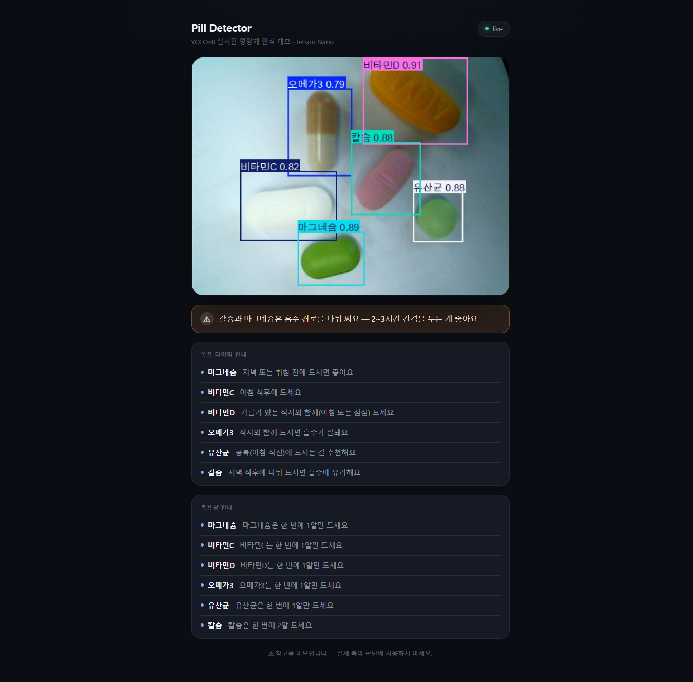
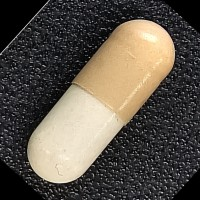
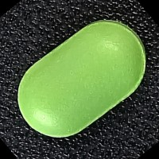
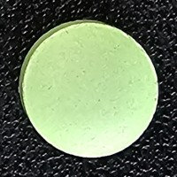
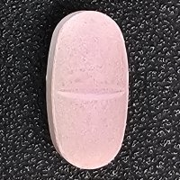
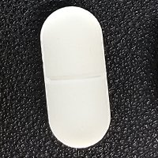
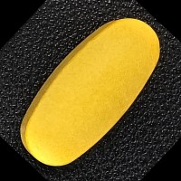

# yolo-pill-classifier

YOLOv8 기반 알약(캡슐/정제) 6종 탐지 프로젝트. 사진을 찍어 데이터셋을 만들고,
YOLOv8을 학습시킨 뒤, Jetson Nano에서 웹캠 영상에 실시간으로 탐지 결과를 띄우는
웹 데모까지가 목표입니다.

<video src="https://github.com/user-attachments/assets/9fc1c7e3-b32c-4d7b-946e-8a9aced14672" width="600" controls></video>

**실시간 탐지 데모** — 웹캠으로 여러 알약을 동시에 인식해 종류·이름을 표시합니다.
카메라 대신 저장된 영상 파일(`stream/server.py --source <영상경로>`)로도 분석할 수 있습니다.



6종 동시 탐지, 조합 주의 배너, 복용 타이밍/복용량 안내까지 한 화면에서 확인할 수
있습니다. 다른 조합 예시는 [`demo/`](demo/) 폴더 참고.

## 클래스 (6종, id 0~5)

<table>
<tr>
<th width="16.6%">0 capsule</th>
<th width="16.6%">1 green_caplet</th>
<th width="16.6%">2 mint_circle</th>
<th width="16.6%">3 pink_caplet</th>
<th width="16.6%">4 white_caplet</th>
<th width="16.6%">5 yellow_caplet</th>
</tr>
<tr>
<td></td>
<td></td>
<td></td>
<td></td>
<td></td>
<td></td>
</tr>
</table>

## 폴더 구조

```
.
├── dataset/              # 학습용 최종 데이터셋 (images/labels train,val + data.yaml)
├── preprocess/           # 라벨링 파이프라인: auto_label.py, split_and_build.py
├── train/                # 학습 스크립트: train_yolo.py
├── notebooks/
│   └── train_on_colab.ipynb  # Colab(T4 GPU)에서 학습하고 싶을 때
├── weights/
│   └── best.pt           # 학습된 가중치 (--export-best로 생성, 데모가 읽는 기본 경로)
├── stream/               # Jetson Nano 실시간 웹 스트리밍 데모
├── docs/
│   ├── report.md         # 트러블슈팅 로그 (문제/원인/조치 기록)
│   ├── update.md         # 날짜별 진행 상황 및 팀원 간 인수인계 메모
│   └── pill_combo_plan.md # 알약 조합 안내 배너 기능 기획서
└── requirements.txt
```

## 설치

```bash
conda create -n yolo python=3.10 -y
conda activate yolo
pip install -r requirements.txt
```

## 데이터셋 파이프라인 (전처리/라벨링)

새로 찍은 사진을 클래스별 폴더(`capsule/`, `green_caplet/`, `mint_circle/`,
`pink_caplet/`, `white_caplet/`, `yellow_caplet/`)에 넣은 뒤:

```bash
# 1. 자동 bbox 라벨링 (+ 미리보기로 검수)
python preprocess/auto_label.py --input_dir <원본사진폴더> --review
#   _review/ 폴더에서 박스 확인 → 이상한 것만 labelImg 등으로 수동 보정

# 2. train/val 분리 + data.yaml 생성
python preprocess/split_and_build.py --input_dir <원본사진폴더> --output_dir dataset --val_ratio 0.15
```

결과물: `dataset/images/{train,val}/`, `dataset/labels/{train,val}/`, `dataset/data.yaml`.
저대비(흰 배경+흰 알약 등) 케이스나 자동 라벨링 실패/오탐 사례는 `docs/report.md`에
원인과 대응 방법이 정리되어 있습니다.

---

> **아래 학습/데모 파트는 팀원이 계속 다듬고 있는 영역이라, 실제 사용법이나 옵션이
> 이 문서보다 앞서 바뀔 수 있습니다 (수정 가능).**

## 학습

로컬 GPU:

```bash
python train/train_yolo.py --device 0 --export-best
```

`--data`를 안 주면 `dataset/` → `dataset_yolo/` → `dataset_yolo_colab/` 순으로 자동
탐지하고, 학습 전에 라벨/클래스 정합성을 먼저 검사합니다. 자세한 옵션은
`python train/train_yolo.py --help` 참고.

Colab(T4 GPU)에서 돌리려면 `notebooks/train_on_colab.ipynb`를 열어서 순서대로
실행하면 됩니다(저장소를 clone하면 코드와 `dataset/`이 같이 받아짐).

학습이 끝나면 `runs/`에 결과가 저장되고, `--export-best`를 주면 `weights/best.pt`로
복사됩니다.

## 실시간 데모 (Jetson Nano)

`weights/best.pt`가 있어야 합니다.

> Jetson Nano는 JetPack 버전 제약 때문에 `ultralytics`/`opencv-python`을
> `requirements.txt`로 그냥 설치하기 어려운 경우가 많습니다. YOLOv8 추론이 이미
> 되는 환경이라는 전제로, 여기서 새로 필요한 건 `fastapi`·`uvicorn[standard]`뿐입니다
> (둘 다 `requirements.txt`에 포함되어 있음). 처음부터 새로 세팅해야 한다면
> `stream/README.md`의 Jetson Nano 참고 사항을 먼저 보세요.

```bash
python stream/server.py
```

Jetson Nano처럼 느린 보드에서는 해상도/전송 프레임을 낮춰서 시작하는 걸 권장합니다:

```bash
python3 stream/server.py --width 480 --height 360 --max-fps 5
```

브라우저로 `http://<보드 IP>:8000/` 접속하면 웹캠 영상에 탐지 결과가 얹혀 보입니다.
Jetson Nano 세팅, 옵션, 성능 관련 참고사항은 `stream/README.md`를 참고하세요.

## 문서

- [docs/report.md](docs/report.md) — 라벨링/전처리/학습 준비 과정에서 있었던 문제와 해결 과정 기록
- [docs/update.md](docs/update.md) — 날짜별 진행 상황, 다음 할 일, 팀원 간 인수인계 메모
- [docs/pill_combo_plan.md](docs/pill_combo_plan.md) — 알약 조합 안내 배너 기능(좋은
  조합/확인 필요 조합) 기획서. `stream/combos.json`·`timing.json`·`dosage.json`으로
  구현 완료
