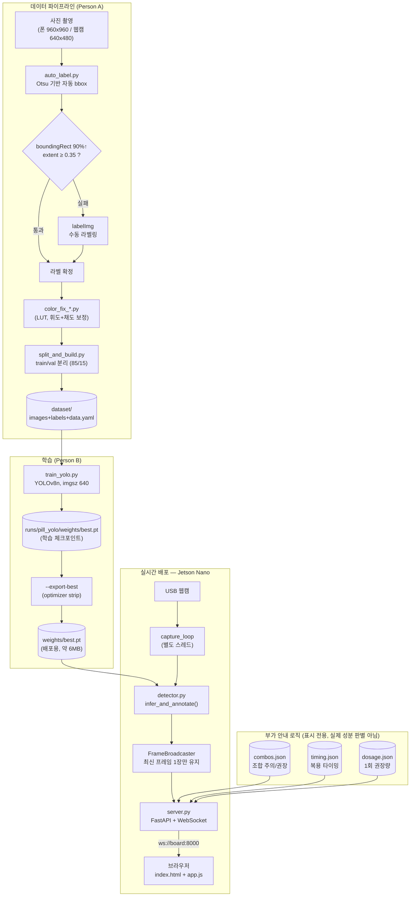

# yolo-pill-classifier 시스템 아키텍처

```mermaid
flowchart TB
    subgraph DATA["데이터 파이프라인 (Person A)"]
        A1["사진 촬영\n(폰 960x960 / 웹캠 640x480)"] --> A2["auto_label.py\nOtsu 기반 자동 bbox"]
        A2 --> A3{"boundingRect 90%↑\nextent ≥ 0.35 ?"}
        A3 -->|실패| A4["labelImg\n수동 라벨링"]
        A3 -->|통과| A5["라벨 확정"]
        A4 --> A5
        A5 --> A6["color_fix_*.py\n(LUT, 휘도+채도 보정)"]
        A6 --> A7["split_and_build.py\ntrain/val 분리 (85/15)"]
        A7 --> A8[("dataset/\nimages+labels+data.yaml")]
    end

    subgraph TRAIN["학습 (Person B)"]
        A8 --> B1["train_yolo.py\nYOLOv8n, imgsz 640"]
        B1 --> B2[("runs/pill_yolo/weights/best.pt\n(학습 체크포인트)")]
        B2 --> B3["--export-best\n(optimizer strip)"]
        B3 --> B4[("weights/best.pt\n(배포용, 약 6MB)")]
    end

    subgraph DEPLOY["실시간 배포 — Jetson Nano"]
        C1["USB 웹캠"] --> C2["capture_loop\n(별도 스레드)"]
        B4 --> C3["detector.py\ninfer_and_annotate()"]
        C2 --> C3
        C3 --> C4["FrameBroadcaster\n최신 프레임 1장만 유지"]
        C4 --> C5["server.py\nFastAPI + WebSocket"]
        C5 -->|"ws://board:8000"| C6["브라우저\nindex.html + app.js"]
    end

    subgraph OVERLAY["부가 안내 로직 (표시 전용, 실제 성분 판별 아님)"]
        D1[("combos.json\n조합 주의/권장")]
        D2[("timing.json\n복용 타이밍")]
        D3[("dosage.json\n1회 권장량")]
    end

    D1 --> C5
    D2 --> C5
    D3 --> C5
```
