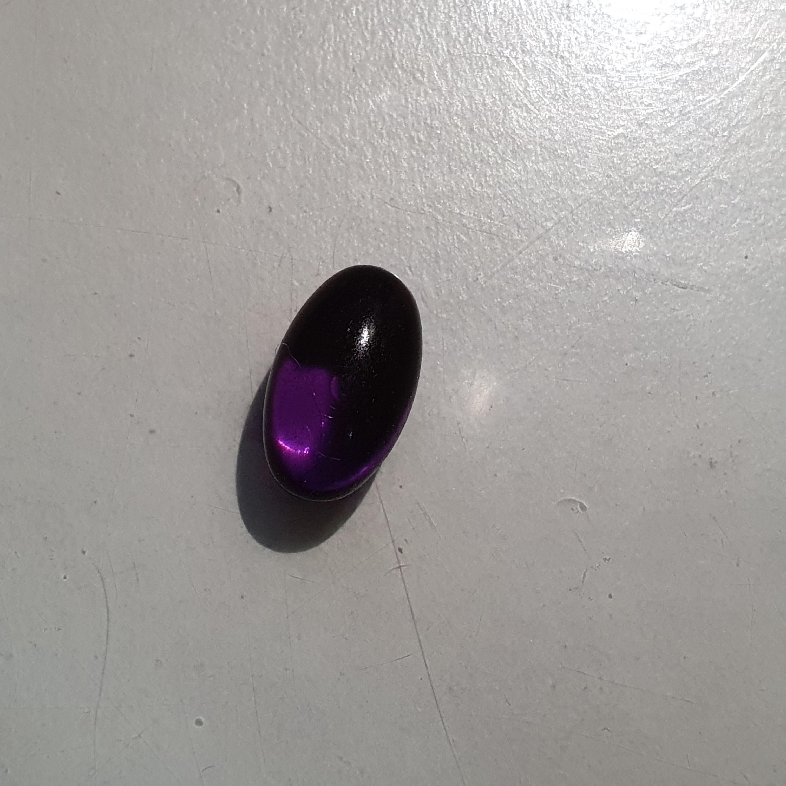
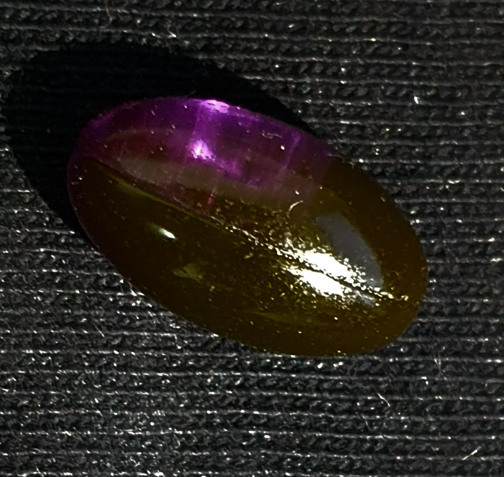
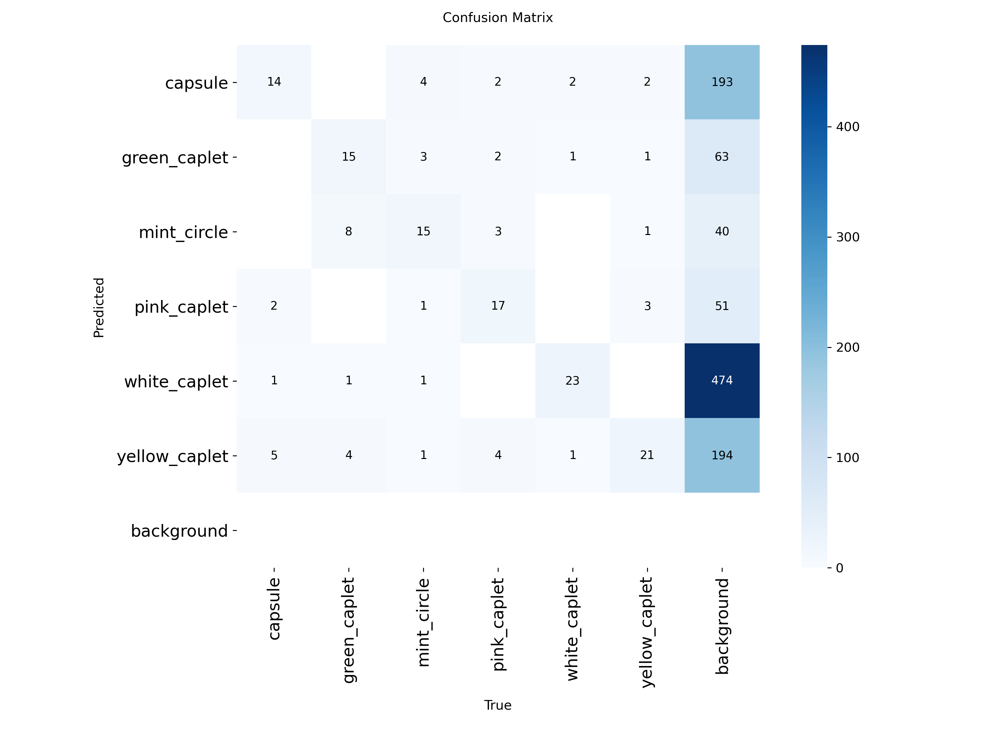
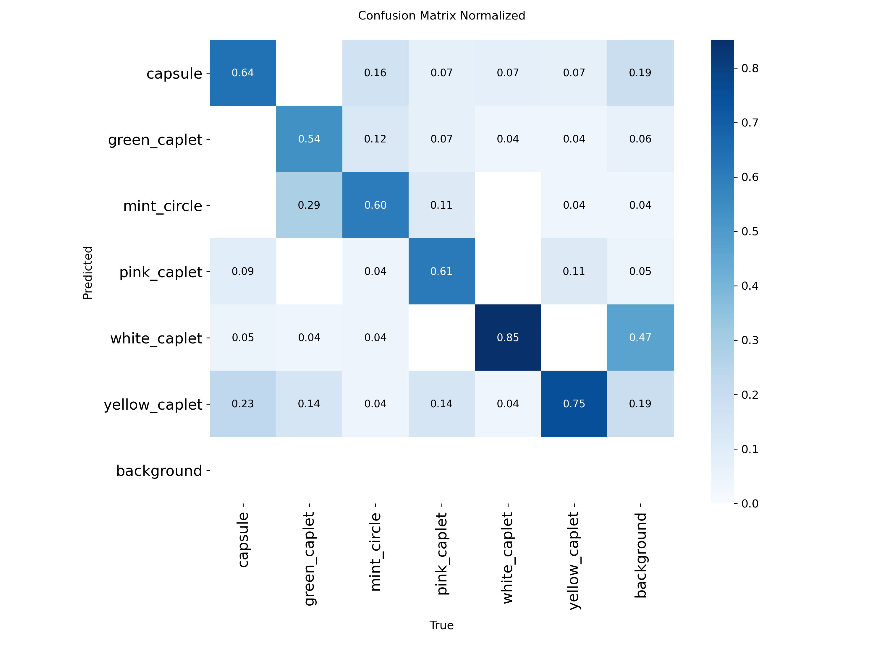

# Troubleshooting

## 0. 전처리 방식
데이터셋이 클래스당 100-150장, 전체 약 800장이라 라벨링을 전부 수작업하기엔 비효율적이라 `preprocess/auto_label.py`(Otsu 임계값 기반)로 자동 bbox 검출을 우선 적용. `white_caplet`(흰 배경+흰 알약)만 대비가 없어 자동 검출이 신뢰 불가해 예외적으로 수작업 병행.

## 1. auto_label.py가 조용히 실패 (저대비 + boundingRect 미검증)
- **증상**: 콘솔엔 "성공"으로 뜨지만 실제 박스는 배경/이미지 전체를 잡고 있었음. 처음엔 `white_caplet`(흰 배경+흰 알약, 68장)에서 발견됐는데, 나중에 820장 전수 스캔해보니 나머지 5개 클래스에서도 192장(23%)이 같은 증상으로 걸림.
- **원인**: ① Otsu 임계값 방식은 배경과 알약이 둘 다 흰색이면 전경/배경을 구분 못함(white_caplet 케이스). ② 컨투어 면적만 검증하고 실제 라벨에 쓰는 `boundingRect` 면적은 검증 안 해서, 그림자/그라데이션으로 흩어진 컨투어의 외접 사각형이 이미지 전체를 덮어도 통과함(나머지 5클래스 케이스).
- **조치**: `boundingRect` 90% 재검증 + 컨투어 채움비(extent) 0.35 미만 실패 처리 필터 추가. 자동 재탐지(필터 개선/GrabCut/HSV 분리)로도 못 건진 나머지는 총 259장(white_caplet 68 + 나머지 191) 수동 라벨링.
- **부수 이슈**: `labelImg` 1.8.6이 PyQt5 5.15와 안 맞아 스크롤 시 float→int 크래시 → 패키지 파일 직접 패치.

## 2. purple_pill 클래스 제외
- **증상**: 반투명 캡슐이라 촬영 배경(흰/검)에 따라 같은 알약이 완전히 다른 색으로 찍힘 — 라벨을 다시 그려도 해결 안 되는 "데이터 일관성" 문제.

  | 흰 배경 | 검은 배경 |
  |---|---|
  |  |  |

- **조치**: 데이터셋에서 클래스 통째로 제외. 재도입하려면 배경 조건 통일해서 재촬영 필요.

## 3. 조명 조건에 따라 white_caplet ↔ pink_caplet 오분류 (색감 보정)
- **증상**: 조명 약할 때 흰 알약이 핑크로, 특정 조건에서 핑크가 흰색으로 오분류. 검은 배경 촬영본이 카메라 화이트밸런스 보정 때문에 색이 탈색되어 보이는 게 원인 (2번 항목과 근본 원인 동일 계열).
- **조치**: 클래스별 원본/폰보정본 사진 쌍(`COLOR/`)으로 톤 커브(LUT)를 실측 학습해서 적용 (`preprocess/color_lut_common.py` + `color_fix_<클래스>.py`).
  - 처음엔 B/G/R 채널 독립 학습 → 배경까지 색조 오염되는 버그 발견 → 휘도(밝기)+채도(HSV S채널)만 따로 학습하는 방식으로 재설계해서 해결.
  - 클래스 섞어 학습 시 오차 2.59/255 → 클래스별 개별 학습 시 0.15-1.3/255로 개선.
- **적용 범위**: 기존 데이터셋의 검은 배경 촬영본 6클래스 전체(403장). 일부 클래스만 보정하면 모델이 색이 아니라 전처리 흔적으로 구분하게 될 위험 있어 전 클래스 동일 처리 필요.

## 4. 웹캠 촬영 배치 추가 및 라벨링
- **배경**: 조명 다양성 확보를 위해 웹캠으로 재촬영(흰 배경 위주, 데모 환경과 맞춤). 해상도(640×480)가 기존 폰 사진(960×960)과 달라도 YOLO 레터박싱으로 문제없음.
- **auto_label.py가 웹캠 사진 전 클래스에서 조용히 실패**: 배경 조명 그라데이션 때문에 전역 Otsu가 어두운 절반을 통째로 전경으로 잡음(전 클래스 박스 면적 평균 50-56%) → median blur로 배경의 완만한 밝기 변화를 추정해 빼는 shading correction(`flatten_background()`) 추가로 개선했지만 완전하진 않아 전수 수동 검수 필요. (수동 검수가 최종 데이터셋에 빠짐없이 반영됐는지는 7번 항목에서 전수 스캔으로 재확인 — 실패 패턴 잔존 0건.)
- **labelImg 이슈**: 박스 생성/드래그 중 미리보기 그리기에서 float→int 크래시 추가 발견·패치(`libs/canvas.py`) / YOLO 라벨 읽으려면 같은 폴더에 `classes.txt` 필요 / 폴더별 저장 시 `classes.txt`가 그 세션에 쓰인 라벨만 남게 재작성돼 다른 파일의 인덱스와 안 맞아 크래시 → 폴더별 인덱스 0으로 통일 후 병합 직전 전역 클래스 번호로 일괄 변환 / Auto Save의 `default_save_dir`이 폴더 전환해도 안 바뀌어 다른 폴더로 잘못 저장될 위험 있음.
- **최종 추가분**: 흰 배경 120장(본인) + 검은 배경 120장(팀원) + 네거티브 20장(배경만, 빈 라벨) — 전부 수동 검수 후 병합.
  - 병합 중 팀원 배치가 두 경로(최상위 폴더 + `dataset_black/` 서브폴더)에 중복 존재해 한 번 겹쳐 들어갈 뻔함 → md5 확인 후 정리, 단일 소스로 재병합. 이후 파일명 전체를 클래스별 순번으로 재정렬.
- **병합 후 최종 장수**: capsule 149 / green_caplet 188 / mint_circle 169 / pink_caplet 186 / white_caplet 181 / yellow_caplet 187 / neg_black 15 / neg_white 5 (train 919 / val 161).

## 5. 최종 모델 검증 결과 (2026-07-28)
- **명령어**: `yolo val model=weights/best.pt data=dataset/data.yaml imgsz=640` (GTX 1660, val 161장)
- **전체**: precision 0.934 / recall 0.973 / mAP50 0.974 / mAP50-95 0.803
- **클래스별**:

  | 클래스 | P | R | mAP50 | mAP50-95 |
  |---|---|---|---|---|
  | capsule | 0.923 | 1.000 | 0.995 | 0.821 |
  | green_caplet | 0.950 | 1.000 | 0.995 | 0.870 |
  | mint_circle | 0.934 | 0.960 | 0.929 | 0.788 |
  | pink_caplet | 0.961 | 1.000 | 0.995 | 0.831 |
  | white_caplet | 0.960 | 0.889 | 0.947 | 0.645 |
  | yellow_caplet | 0.874 | 0.990 | 0.985 | 0.865 |

- **확인**: `white_caplet`이 recall·mAP50-95 모두 최하위 — 3번 항목(색감 보정)에서 다룬 조명 조건 오분류 문제가 LUT 보정 후에도 완전히 해결되진 않고 잔여 약점으로 남아있음을 수치로 확인.
- **추론 속도**: GTX 1660 기준 5.0ms/image (preprocess 1.0ms + inference 5.0ms + postprocess 0.8ms). 실제 배포 타깃인 Jetson Nano에서는 훨씬 느림 — 실측 로그는 6번 항목 참고.
- 산출물(confusion matrix 등)은 `runs/detect/runs/val_report/`에 저장됨.

  | Confusion Matrix | Normalized |
  |---|---|
  |  |  |

## 6. Jetson Nano 실측 FPS (2026-07-28)
- **보드**: Jetson Nano, L4T R32.6.1(JetPack 4.6 계열), USB 웹캠 `/dev/video0`(YUYV, 640x480 최대 30fps 지원 — 카메라 자체는 병목이 아님).
- **명령어**: `python3 -u stream/server.py --width 480 --height 360 --max-fps 5` (`weights/best.pt`, `yolo_v8` venv: torch 1.13.0a0 CUDA, ultralytics 8.3.0, opencv 5.0.0).
- **측정 방식**: `stream/server.py`의 `capture_loop`가 5초 창마다 콘솔에 찍는 `[stream] inference fps` 로그를 그대로 캡처. 이 수치는 웹소켓 전송 제한(`--max-fps`)과 무관하게 카메라 읽기+YOLO 추론 자체의 실측 처리량이다. 두 번째 실행(120초 연속 구동)에서는 `tegrastats --interval 1000`을 같이 돌려 온도/CPU·GPU 사용률/RAM을 함께 기록했고, 브라우저(`http://<보드IP>:8000/`)로 실제 알약이 잡히는 것도 육안 확인했다.
- **전력/클럭 상태**: `nvpmodel -q` → MAXN(최대 성능 모드). `jetson_clocks --show` → CPU 4코어 전부 1479MHz 고정(Min=Max=Current), GPU 921.6MHz 고정, EMC 1.6GHz 고정 — 클럭은 이미 최대치라 설정으로 더 끌어올릴 여지 없음.
- **1차 (10초, 2개 창)**: 안정화 후 **5.2fps**로 일관되게 기록.
- **2차 (120초 연속 구동, 19개 창)**: 시작 직후 6.9-7.3fps → 점진적으로 하락 → 약 70초 지점부터 **3.7-3.8fps로 수렴**. 19개 창 평균 4.9fps.
- **3차 (별도 재시작, 90초 연속 구동, 13개 창)**: 재현성 확인을 위해 서버를 완전히 새로 띄워 재실행. 시작 직후 5.0fps → 약 60초 지점부터 **3.3-4.3fps로 수렴**.
- **종합(3회 독립 실행)**: 시작 직후 초기값은 5.0-7.3fps로 실행마다 들쭉날쭉하지만(조명·장면 상태에 따라 첫 몇 프레임의 추론/후처리 비용이 달라지는 것으로 보임), **세 번 모두 예외 없이 하락해서 1분 전후로 3.3-4.3fps 구간에 수렴**하는 패턴은 재현됨. 따라서 초기 고fps 구간을 대표값으로 쓰면 안 되고, **장시간 구동 기준 대표값은 약 3.5-4fps**로 보는 게 맞다.
- **온도/GPU 사용률**: GPU 26→29.5°C, CPU 패키지 27→30.5°C로 거의 안 오름 — 열 스로틀링은 확실히 아님. `GR3D_FREQ`(GPU 사용률)는 120개 샘플 중 70개가 0%이고 나머지가 94-99% 스파이크인 버스티 패턴이라 GPU 컴퓨트 자체는 병목이 아니다. 3차 실행 중 시스템 전체 `top` 요약으로는 유휴 상태 구간에도 user CPU 20-25%(4코어 중 대략 1코어 분량)가 꾸준히 잡혀 GPU가 노는 동안 CPU 한 코어가 계속 일하고 있음을 뒷받침한다 — `capture_loop`가 단일 스레드(카메라 읽기+전처리+JPEG 인코딩을 순차 처리)로 도는 구조(`stream/server.py:147`)와 부합한다. 다만 `top -H`로 스레드/함수 단위까지 쪼개려던 시도는 PID 추적이 어긋나 실패했으므로, "단일 코어 순차 처리가 병목"이라는 결론은 정황 근거이지 프로파일러로 직접 확인한 것은 아니다.
- **RAM**: 두 번의 독립 실행(2차·3차) 모두 1.2-1.3GB에서 시작해 20초 안팎에 **3.1-3.2GB(전체 3.96GB의 79-80%)까지 오른 뒤 그 수준에서 평평하게 유지**되는 동일한 패턴이 재현됐다. 프로세스가 끝나면 시스템 RAM은 두 번 다 1.2GB대로 되돌아왔다(2차 종료 후, 3차 종료 후 모두 확인) — 즉 재부팅 없이는 안 없어지는 시스템 레벨 누수는 **아니고**, 서버 프로세스 생존 기간에 국한된 증가다. 다만 FPS 하락은 RAM이 평평해진 뒤로도 한동안(2차 약 50초, 3차 약 40초) 더 이어졌으므로, RAM 상승 자체가 fps 하락의 직접 원인이라고 단정할 근거는 없다 — 같은 시점대에 함께 벌어지는 현상이라는 것만 재현 확인됐고, 인과관계는 미확인으로 남겨둔다.
- **육안 확인**: 브라우저 접속 시 실제 웹캠 영상에 알약 bbox+라벨이 정상적으로 표시되는 것을 확인함(2026-07-28).
- **결론(추정치 교체)**: README·`stream/README.md`에 있던 "체감 1-3FPS" 표현은 이 실측값으로 교체했다 — **초기 5-7fps, 1분 이상 지속 구동 시 3.3-4.3fps로 수렴(대표값 약 3.5-4fps)**, 3회 독립 실행으로 재현 확인.
- **다음 할 일**: (1) RAM이 3.1GB대에서 더 안 오르는데도 fps는 왜 계속 떨어지는지 — 정확한 인과관계 프로파일링(`tracemalloc`/`memory_profiler`로 어떤 객체가 쌓이는지, 프레임마다 `gc.collect()` 강제해보고 fps 회복되는지 테스트). (2) 이번에 실패한 스레드/함수 단위 CPU 프로파일링 재시도(`py-spy` 등 설치해서 `capture_loop` 내부 어느 구간이 시간을 먹는지 직접 확인).
- **트러블슈팅**: 첫 시도에서 `cap.read()`는 정상인데도 FPS 로그가 전혀 안 찍혀서 원인 확인 결과, non-tty(SSH 비대화형 실행) 환경에서 Python stdout이 풀 버퍼링되고 `timeout`이 SIGTERM으로 프로세스를 끊으면서 버퍼가 플러시되지 않아 `print()` 출력이 통째로 유실됐던 것으로 확인. `python3 -u`(unbuffered)로 재실행해 해결. 이런 식으로 원격/비대화형 실행 시 로그 캡처가 필요하면 `-u` 또는 `PYTHONUNBUFFERED=1`을 기본으로 붙이는 게 안전.

## 7. 데이터셋/모델 무결성 검증 (2026-07-28)
1번·4번 항목에서 다룬 auto_label.py 실패(전경/배경 혼동, boundingRect 미검증)를 수작업으로
고친 뒤, 그 수정이 최종 데이터셋에 실제로 빠짐없이 반영됐는지 별도 스크립트와 프로젝트
자체 검사 도구 두 가지로 교차 확인했다.

- **클래스별 장수 재검산**: `dataset/images,labels/{train,val}`을 직접 스캔한 결과 —
  train 919(capsule 127/green_caplet 160/mint_circle 144/pink_caplet 158/white_caplet 154/
  yellow_caplet 159/neg_black 13/neg_white 4), val 161(22/28/25/28/27/28/neg_black 2/neg_white 1).
  4번 항목·`docs/update.md`에 적힌 합계(149/188/169/186/181/187/15/5, train 919/val 161)와 **정확히 일치**.
- **라벨 좌표/클래스 id 유효성**: 전체 라벨 파일을 파싱해 필드 수(5개), class id 범위(0-5),
  좌표 정규화 범위(0-1) 검사 — **이상 0건**.
- **auto_label 실패 패턴 잔존 여부**: bbox 면적이 이미지의 85% 이상을 덮는 라벨(1번 항목에서
  발견된 "박스가 배경/이미지 전체를 잡는" 실패 시그니처)을 전수 스캔 — **잔존 0건**. 수작업
  보정이 실제로 문제를 다 잡았음을 확인.
- **네거티브 샘플 규칙**: `neg_black_*`/`neg_white_*` 파일은 전부 빈 라벨, 그 외 파일 중 빈
  라벨은 0건 — `docs/update.md`에 적힌 "네거티브만 빈 라벨 허용" 규칙과 일치.
- **train/val 교차 중복(데이터 누수) 검사**: 전체 이미지 MD5 체크섬 비교 — train/val 교차
  중복 0건, 동일 split 내 중복도 0건. 4번 항목에서 있었던 "팀원 배치 중복 병합" 사고가
  최종 데이터셋에는 남아있지 않음을 확인.
- **`train/train_yolo.py`의 `preflight()` 자체 검사와 교차 검증**: 학습을 실제로 돌리지 않고
  `preflight(Path("dataset"))`만 직접 호출 — 위 스캔과 동일한 카운트를 출력하며 예외 없이 통과.
  `docs/update.md`에서 팀원에게 요청했던 "`neg_` 접두사는 빈 라벨 예외 처리" 로직도
  (`train/train_yolo.py:52-171`, `NEG_PREFIX` 처리) 이미 반영되어 있음을 코드로 확인.
- **5번 항목 검증 지표 재현**: `yolo val model=weights/best.pt data=dataset/data.yaml imgsz=640`을
  다시 돌려 precision/recall/mAP50/mAP50-95와 클래스별 세부 수치까지 5번 항목과 **소수점까지
  동일하게 재현**됨을 확인(우연이 아니라 결정적으로 재현 가능한 결과임을 뜻함).
- **모델 파일 일치성**: 위 정확도 재현에 쓴 로컬 `weights/best.pt`와 6번 항목 Jetson FPS 측정에
  쓰인 Jetson `~/yolo-pill-classifier/weights/best.pt`의 MD5 체크섬이 동일
  (`de7077d07527323994b2d068aac0204a`) — 정확도 수치와 FPS 수치가 서로 다른 모델을 가리키고
  있을 위험 없음.
- **결론**: 수작업 라벨 보정이 "그때 눈으로 확인한 몇 장"이 아니라 최종 데이터셋 전체에
  걸쳐 빠짐없이 반영되어 있음을 정량적으로 확인. 기술서에는 "수작업으로 보정했다"뿐 아니라
  이 무결성 검증 결과(이슈 0건, 카운트 일치, 누수 0건, 지표 재현)를 근거로 같이 제시 가능.