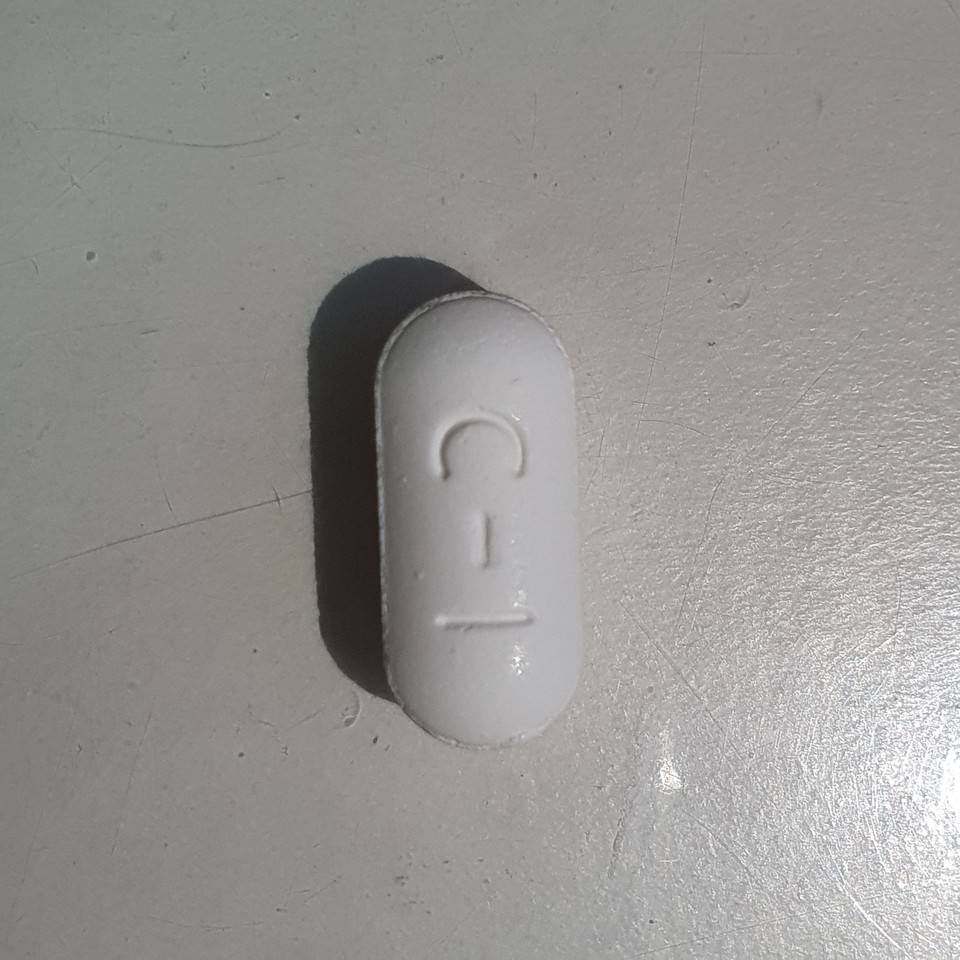
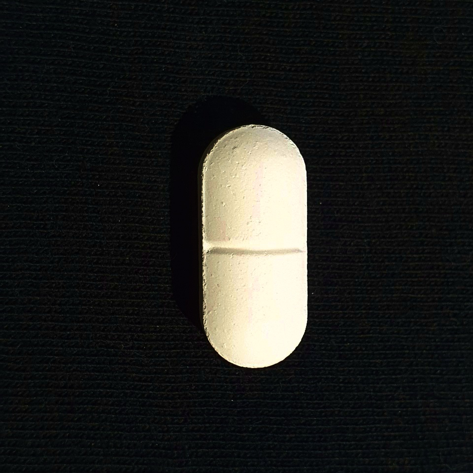
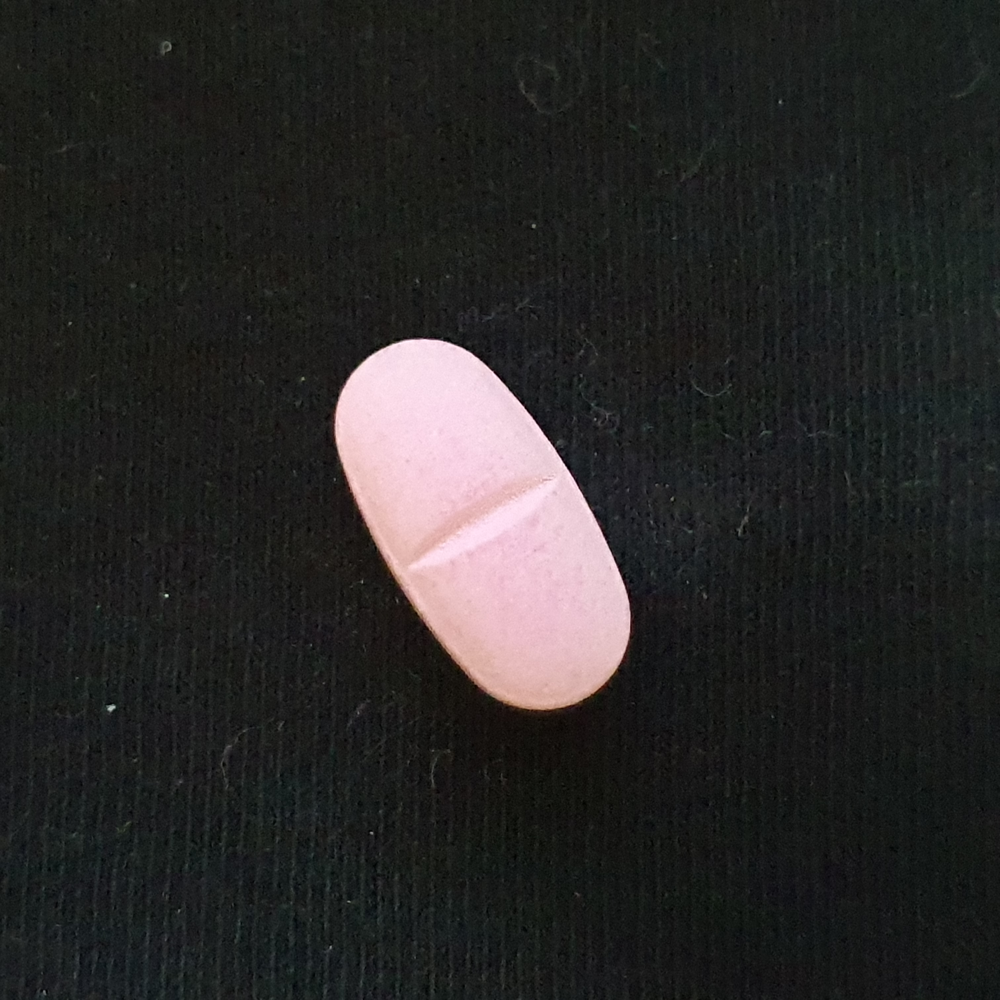
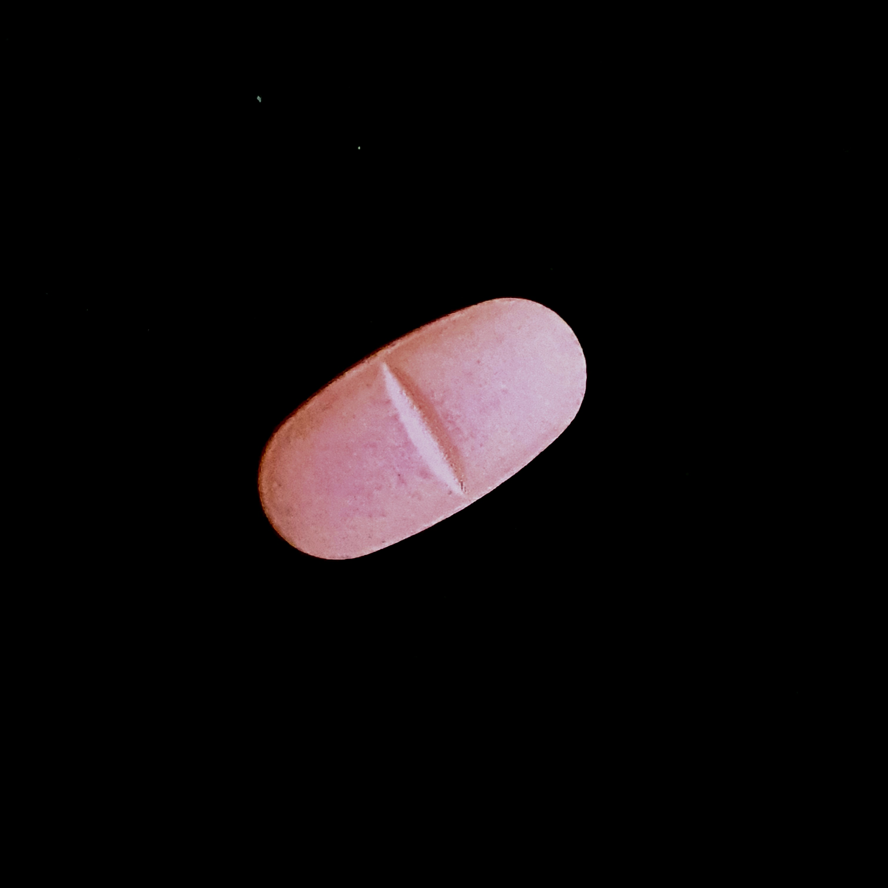

# Troubleshooting

## 1. Otsu 기반 자동 라벨링 실패

### 문제

데이터셋(약 820장)은 `auto_label.py`로 Otsu Threshold 기반 자동 bbox 생성 후 검수하는 방식으로 구축했다.

초기에는 `white_caplet`만 문제인 줄 알았으나, 전체 데이터셋을 재검토한 결과 다른 클래스까지 포함해 약 23%(192장)가 잘못된 bounding box를 가지고 있었다.

대표적인 실패 원인은 두 가지였다.

* 흰 배경 + 흰 알약 → 전경/배경 분리 실패
* 그림자 때문에 컨투어는 작지만 boundingRect가 이미지 대부분을 덮는 경우

  | 흰 배경 (저대비 — 자동 검출 실패) | 검은 배경 (고대비 — 정상 검출) |
  |---|---|
  |  |  |

### 원인

기존 스크립트는

* contour area만 검증
* 실제 라벨로 사용하는 boundingRect는 검증하지 않음

때문에 잘못된 bbox가 정상으로 저장되고 있었다.

### 해결

자동 라벨러를 다음과 같이 수정했다.

* boundingRect 면적 90% 이상 실패 처리
* extent(채움비) 0.35 미만 실패 처리
* GrabCut / HSV 기반 재검출 추가

자동 복구되지 않는 이미지 259장은 수동 라벨링하였다.

### 추가 이슈

labelImg 1.8.6이 PyQt5 5.15에서 float→int 예외로 종료되는 문제를 발견하여 직접 패치하였다.

---

## 2. 웹캠 데이터셋 구축 과정

### 문제

조명 다양성을 확보하기 위해 웹캠 데이터셋을 추가 촬영하였다.

그러나 전역 Otsu Threshold가 배경의 밝기 그라데이션을 객체로 인식하여 모든 클래스에서 bbox가 비정상적으로 생성되었다.

### 해결

median blur 기반 shading correction(`flatten_background()`)을 추가하여 조명 영향을 줄였다.

그래도 완전하지 않아 모든 이미지를 수동 검수하였다.

추가로 labelImg 사용 중 발견한 문제도 함께 수정하였다.

* float→int crash
* classes.txt 관리 문제
* Auto Save 경로 오류
* 클래스 인덱스 병합 문제

병합 과정에서는 MD5 검사를 이용하여 중복 데이터를 제거하였다.

---

## 3. 조명에 따른 색상 변화

### 문제

검은 배경에서 촬영한 이미지가 카메라 화이트밸런스 영향으로 탈색되어

* white ↔ pink

오분류가 발생하였다.

  | 보정 전 (화이트밸런스로 색 탈색) | 보정 후 (LUT 적용) |
  |---|---|
  |  |  |

### 해결

클래스별 LUT를 생성하여 색감을 보정하였다.

초기에는 RGB 채널별 LUT를 적용했지만 배경까지 변색되는 문제가 발생하여

* 밝기(L)
* 채도(S)

만 보정하는 방식으로 변경하였다.

클래스를 통합해 LUT를 만들 경우 평균 오차가 2.59였으나,

클래스별 LUT 적용 후 0.15~1.3 수준으로 감소하였다.

기존 검은 배경 촬영본 403장 전체에 동일하게 적용하였다.

---

## 4. purple_pill 클래스 제거

### 문제

반투명 캡슐 특성상

* 흰 배경
* 검은 배경

에서 서로 다른 색으로 촬영되었다.

이는 라벨 수정으로 해결 가능한 문제가 아니라 데이터 자체의 일관성 문제였다.

  | 흰 배경 | 검은 배경 |
  |---|---|
  |  |  |

### 해결

해당 클래스를 데이터셋에서 제외하였다.

재도입하려면 동일 조명·동일 배경 조건으로 재촬영이 필요하다.

---

# Validation

## 데이터셋 무결성

최종 데이터셋에 대해 자동 검사를 수행하였다.

* 클래스 수 검증
* bbox 형식 검증
* 좌표 범위 검증
* auto_label 실패 패턴 재검사
* negative label 규칙 확인
* train/val MD5 중복 검사

모든 항목을 통과하였다.

---

## 모델 재현성

* preflight() 검사 결과 동일
* validation 재실행 결과 동일
* Jetson / Local best.pt MD5 동일

학습 결과와 Jetson 배포 모델이 동일함을 확인하였다.

---

# Result

## Validation Result

`yolo val model=weights/best.pt data=dataset/data.yaml imgsz=640` (GTX 1660, val 161장)

전체: precision 0.934 / recall 0.973 / **mAP50 0.974 / mAP50-95 0.803**, 추론 5.0ms/image

| 클래스 | P | R | mAP50 | mAP50-95 |
|---|---|---|---|---|
| capsule | 0.923 | 1.000 | 0.995 | 0.821 |
| green_caplet | 0.950 | 1.000 | 0.995 | 0.870 |
| mint_circle | 0.934 | 0.960 | 0.929 | 0.788 |
| pink_caplet | 0.961 | 1.000 | 0.995 | 0.831 |
| white_caplet | 0.960 | 0.889 | 0.947 | 0.645 |
| yellow_caplet | 0.874 | 0.990 | 0.985 | 0.865 |

`white_caplet`이 recall·mAP50-95 최하위 — 3번(색감 보정) 이후에도 남은 잔여 약점.

| Confusion Matrix | Normalized |
|---|---|
|  |  |

---

## Jetson Nano Performance

* 시작 직후 : 5~7 FPS
* 안정화 후 : 3.3~4.3 FPS
* 대표값 : 약 3.5~4 FPS

온도는 26→30°C로 유지되어 열 스로틀링은 발생하지 않았다.

GPU는 버스티하게 동작하고 CPU 한 코어가 지속적으로 사용되어, 현재 병목은 capture → preprocessing → encoding의 단일 스레드 처리로 추정된다.

> 이 저하는 특정 보드(.107)에서만 재현됐다 — 아래 "Board Variance" 참고.

---

## Board Variance (2026-08-13 후속 조사)

측정에 쓴 보드(.107)의 SD카드가 이후 리셋되어, 동일 조건(코드·모델·클럭·전력모드)을 다른 보드(.108)에서 재현했다.

* `.108`에서 110초 연속 측정 — **7.0~7.4 FPS로 저하 없이 안정**(원 실험의 3.3~4.3 FPS 수렴과 불일치)
* RAM은 `.108`에서도 동일하게 3.1GB대(약 80%)까지 상승 후 유지 — **RAM 증가가 FPS 저하의 원인은 아님**을 확인(동일 RAM 패턴에서도 저하 없음)
* GPU 온도(24~27.5°C)·버스티 사용 패턴(대부분 유휴, 간헐적 94~99% 스파이크)도 두 보드 동일
* 원 측정 커밋(`1212c0c`)과 재현 커밋(`f261fe1`) 사이 `stream/server.py`/`detector.py` diff 확인 — latency 계측 코드 추가뿐, 캡처/추론/그리기 로직은 동일
* model/best.pt MD5(`de7077d07527323994b2d068aac0204a`) 두 보드 동일, 전력모드 MAXN·클럭 고정도 동일

즉 **"안정화 후 3.5~4 FPS"는 프로젝트의 일반적 특성이 아니라 `.107` 보드(또는 그 SD카드)에 국한된 결과일 가능성이 높다.** 원인은 SD카드 개별 편차 / 전원 공급 품질 / 보드 고유 문제 중 하나로 추정되나, `.107`에 물리적으로 재접근하기 전까지 확정할 수 없다(현재 전원 꺼짐, 원격 부팅 불가).

### 단계별 Latency (`.108`, 492프레임)

| 단계 | 평균 | P50 | P95 |
|---|---:|---:|---:|
| capture | 1.38ms | 1.36ms | 1.43ms |
| resize | 1.16ms | 1.16ms | 1.22ms |
| preprocess | 9.98ms | 9.91ms | 10.24ms |
| inference | 63.16ms | 63.01ms | 63.51ms |
| postprocess | 6.70ms | 6.79ms | 7.78ms |
| draw | 49.55ms | 46.93ms | 61.06ms |
| encode | 2.94ms | 2.95ms | 3.00ms |
| **total** | **136.86ms** | **134.30ms** | **148.52ms** |

`draw`(bbox/라벨 그리기)가 `inference`의 78%, 전체의 36%를 차지 — 예상보다 큰 비중이며, TensorRT로 inference를 줄여도 다음 병목이 될 가능성이 높다(`docs/jetson_yolov8_optimization_roadmap.md` 참고).
